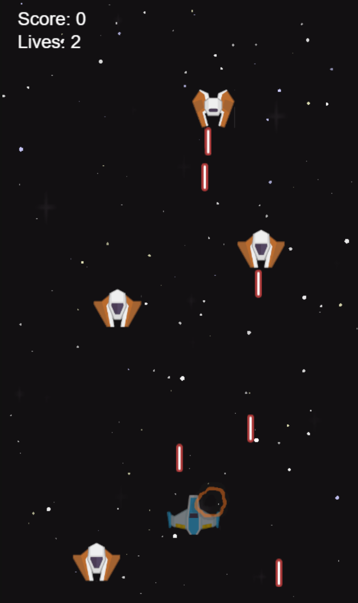
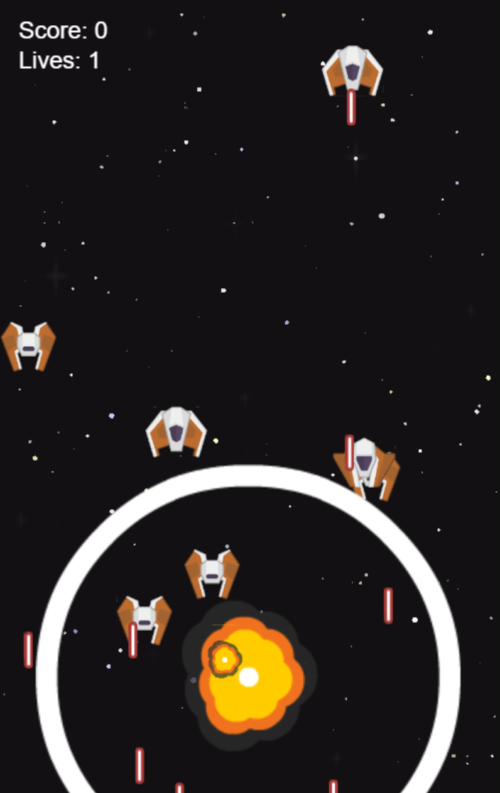

# 🚀 Pixi Space Shooter 👾

**Blast off into an epic space adventure!** This action-packed top-down shooter brings the classic arcade experience to your browser with stunning visuals and heart-pounding gameplay!

## 📸 Game Screenshots




## ✨ Awesome Features

- 🎮 **Intense Gameplay**: Take control of your spaceship, dodge enemy fire, and blast them out of the sky!
- 📈 **Escalating Challenge**: Enemies become more frequent and aggressive the longer you survive
- ❤️ **Health & Lives System**: Manage your ship's health and make every life count
- 🏆 **Scoring System**: Rack up points with every enemy you obliterate
- 💥 **Spectacular Effects**: Witness dazzling explosions and laser animations
- 🔊 **Immersive Audio**: Experience the battle with powerful sound effects
- ✨ **Dynamic Starfield**: Cruise through a parallax star background that creates amazing depth
- 🧠 **Smart Architecture**: Built on a clean state machine pattern for rock-solid performance

## 🕹️ How to Play

- 🔼🔽◀️▶️ **Arrow Keys**: Navigate your ship through the cosmos
- 🔫 **Space Bar**: Unleash your laser fury!
- 🎯 **Mission**: Survive as long as possible while destroying enemy ships
- 💪 **Starting Lives**: 3 chances to prove your skill
- 💓 **Ship Health**: Your vessel can withstand 100 damage points
- 💀 **Game Over**: When all lives are exhausted, see your final score
- 🔄 **New Game**: Hit Space to jump back into the action after game over

## 🛠️ Development

### 🔧 Tech Stack

- 📝 **Language**: TypeScript
- 🖥️ **Rendering**: Pixi.js 8.9
- 🔈 **Audio**: Howler.js
- 🏗️ **Build Tools**: Webpack and Vite
- 🧩 **Architecture**: Finite State Machine pattern

### 🚀 Building & Running

```bash
# Install dependencies
npm install

# Development with Vite
npm run dev

# Development with Webpack
npm run dev:webpack

# Production build with Webpack
npm run build

# Production build with Vite
npm run build:vite

# Preview Vite build
npm run preview
```

## 🧠 Development Process

This game was crafted using the Cursor AI-assisted IDE with Claude 3.7 Sonnet, leveraging the incredible Cursor Memory Bank system to maintain context and consistent development patterns throughout the project.

### 💾 Cursor Memory Bank

The Memory Bank system provided a game-changing approach to AI-assisted development by maintaining these critical project documents:

- 📋 **Project Brief**: Core requirements and specifications for the space shooter game
- 🏛️ **System Patterns**: Architecture decisions and design patterns used across components
- 📚 **Technical Context**: Framework knowledge and implementation details for Pixi.js
- 🔍 **Active Context**: Current development focus and priorities during coding sessions
- 📊 **Progress Tracking**: Features completed and roadmap for remaining work

This powerful approach ensured the AI assistant could maintain perfect context between sessions, resulting in consistent code style, architecture decisions, and implementation patterns throughout the entire project lifecycle.

### 🧩 Code Architecture

The Memory Bank approach helped in creating a well-structured codebase with these awesome components:

- ⚙️ **State Machine Pattern**: Clean separation of behaviors for game entities
- 🎬 **Game Scene Management**: Organized scene transitions and UI elements
- 🖼️ **Asset Loading System**: Efficient texture and sound management
- 🔄 **Projectile Pooling**: Performance optimization for laser projectiles
- 💥 **Collision Detection**: Precise hit detection with appropriate visual feedback
- 🧩 **Entity Component System**: Modular approach to game object capabilities

## 🎮 Assets

The game comes alive with vibrant sprite sheets for ships, lasers, and explosions, along with thrilling audio effects for a complete gaming experience!

## 🚀 Future Enhancements

Get excited for these potential power-ups in future updates:

- 🛡️ **Power-ups**: Shields, weapon upgrades, and speed boosts
- 👽 **Enemy Variety**: Different enemy types with unique and challenging behaviors
- 👑 **Boss Battles**: Epic showdowns with massive boss ships after reaching score milestones
- 📱 **Mobile Support**: Touch controls for gaming on the go
- 🏆 **Local High Scores**: Compete against yourself and break your own records
- 🌟 **Level System**: Structured progression with increasing challenges
- 🌌 **Background Variety**: More stunning space environments and parallax layers

## 👏 Acknowledgments

Special thanks to:

- 🖥️ **Cursor AI**: For providing the incredible AI-assisted development environment
- 🤖 **Claude 3.7 Sonnet**: For brilliant AI assistance in coding and problem-solving
- 🎮 **Pixi.js Team**: For the excellent 2D rendering engine that makes the magic happen
- 📝 **TypeScript Team**: For the strongly-typed language that improved code quality
- 🎨 **Asset Creators**: For the game sprites and sound effects that bring the game to life

## ⚖️ License

This project was created for educational purposes. All assets used are believed to be free for non-commercial use.

---

🎮 Strap in, blast off, and enjoy the game! Your feedback and contributions are always welcome! 🚀 